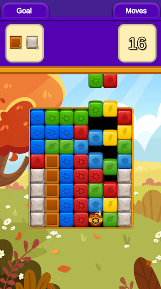

# BlastGame
Blast! style Mobile Game

Blast matching blocks and destroy the objectives to progress through the levels. But beware, you only have a limited number of moves!

This project was built using Unity and C# and is not intended for commercial use.

## Screenshots

  
  

## Features

- Tap on 2 or more matching adjacent blocks to Blast them
- Blast 5 or more blocks to create a TNT
- Use TNT destroy many blocks in a radius
- Combine 2 or more TNT for a bigger BOOM!
- Certain objectives can only be damaged by TNT
- Watch new blocks fall from the sky as you Blast away!

## How to Play

1. Download the .zip file for your platform.
2. Run the Blast!.exe executable.
3. Have fun!
